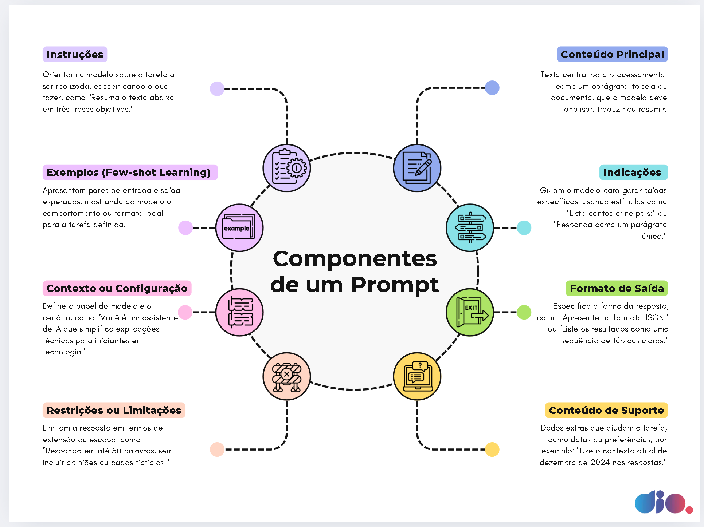

# Dominando a Engenharia de Prompts: Comunicando-se Efetivamente com Inteligência Artificial

## Introdução: A Essência da Engenharia de Prompts

A Engenharia de Prompts é a disciplina fundamental para interagir de forma eficaz e precisa com Modelos de Linguagem de Grande Escala (LLMs) e outras IAs generativas. A **ideia chave** por trás da engenharia de prompts é que a qualidade da saída de um modelo de IA é diretamente proporcional à qualidade da entrada (o "prompt") que ele recebe. Trata-se de uma habilidade estratégica que envolve formular instruções, fornecer contexto e guiar o modelo para que ele gere respostas relevantes, coerentes e alinhadas com os objetivos do usuário.

Dominar a engenharia de prompts não é apenas sobre "fazer perguntas" à IA, mas sim sobre projetar conversas e instruções que explorem o máximo do potencial dessas tecnologias, transformando-as em ferramentas poderosas para criação, análise, resolução de problemas e automação.

## Desvendando os Componentes de um Prompt Eficaz

Um prompt bem construído é composto por diversos elementos que trabalham em conjunto para orientar o modelo. A imagem abaixo ilustra esses componentes essenciais, que são a base para uma comunicação clara e direcionada com a IA:



## Técnicas Fundamentais de Engenharia de Prompts

1.  **Clareza e Especificidade:**
    * Seja o mais explícito possível sobre o que você quer. Evite ambiguidades.
    * Quanto mais detalhes relevantes você fornecer, melhor será o resultado.

2.  **Zero-shot Prompting:**
    * Dar uma instrução direta ao modelo sem exemplos prévios. Funciona bem para tarefas que o modelo já foi treinado extensivamente.
    * Exemplo: "Qual é a capital da França?"

3.  **Few-shot Prompting:**
    * Fornecer alguns exemplos (shots) de entradas e saídas desejadas para guiar o modelo. Útil para tarefas mais complexas ou quando se deseja um formato específico.
    * Exemplo:
        * "Cliente: Preciso de ajuda com minha senha. Assistente: Posso ajudar a redefinir sua senha. Qual é o seu email?"
        * "Cliente: O produto chegou quebrado. Assistente: [Peça ao modelo para gerar uma resposta empática e uma solução]"

4.  **Chain-of-Thought (CoT) Prompting:**
    * Incentivar o modelo a "pensar passo a passo" antes de dar a resposta final, especialmente para problemas que exigem raciocínio.
    * Exemplo: "Some 5 + 8. Explique o seu raciocínio passo a passo antes de dar o resultado final."

5.  **Definição de Persona/Papel:**
    * Instruir o modelo a atuar como um especialista ou assumir uma determinada personalidade.
    * Exemplo: "Aja como um revisor de textos experiente e corrija os erros gramaticais no texto a seguir."

6.  **Uso de Delimitadores:**
    * Utilizar caracteres como `"""`, `---`, `<tag>`, `##` para separar claramente diferentes partes do prompt (instrução, contexto, dados).
    * Exemplo:
        ```
        Contexto: """Você é um bot de atendimento ao cliente."""
        Instrução: """Responda à seguinte pergunta do cliente:"""
        Pergunta do Cliente: """Como posso rastrear meu pedido?"""
        ```

7.  **Restrições e Limitações:**
    * Especificar o que o modelo *não* deve fazer ou quais limites deve respeitar (ex: "Não use jargões técnicos", "Limite a resposta a 100 palavras").

8.  **Iteração e Refinamento:**
    * A engenharia de prompts é um processo iterativo. Teste diferentes abordagens, analise as respostas e refine seus prompts para obter melhores resultados.


Vamos detalhar cada um desses componentes, conforme apresentados na imagem:

1.  **📜 Instruções:**
    * **O que é:** Orientam o modelo sobre a tarefa a ser realizada, especificando o que fazer.
    * **Importância:** É o comando principal que define a ação desejada (ex: "Resuma o texto abaixo em três frases objetivas.", "Traduza para o inglês:", "Escreva um poema sobre..."). A clareza aqui é crucial.

2.  **📄 Conteúdo Principal:**
    * **O que é:** O texto central para processamento, como um parágrafo, tabela ou documento que o modelo deve analisar, traduzir, resumir, etc.
    * **Importância:** É o "objeto" sobre o qual a instrução irá atuar. Sem um conteúdo claro (quando necessário), a instrução pode ser ambígua.

3.  **🎭 Contexto ou Configuração:**
    * **O que é:** Define o papel do modelo (persona) e o cenário em que ele opera.
    * **Importância:** Ajuda a IA a adotar um tom, estilo ou nível de conhecimento específico (ex: "Você é um assistente de IA que simplifica explicações técnicas para iniciantes em tecnologia.", "Aja como um crítico de cinema...").

4.  **💡 Exemplos (Few-shot Learning):**
    * **O que é:** Apresentam pares de entrada e saída esperados, mostrando ao modelo o comportamento ou formato ideal para a tarefa definida.
    * **Importância:** Particularmente útil para tarefas complexas ou quando se deseja um formato de saída muito específico, pois o modelo aprende pelo exemplo.

5.  **📊 Conteúdo de Suporte:**
    * **O que é:** Dados extras que ajudam na tarefa, como datas, preferências ou informações contextuais adicionais.
    * **Importância:** Refina a resposta, tornando-a mais relevante e precisa para a situação (ex: "Use o contexto atual de dezembro de 2024 nas respostas.", "Considere que o usuário prefere um tom formal.").

6.  **👉 Indicações (de Saída):**
    * **O que é:** Guiam o modelo para gerar saídas específicas, usando estímulos ou frases direcionais.
    * **Importância:** Ajuda a moldar a natureza da resposta, mesmo dentro de um formato já definido (ex: "Liste pontos principais", "Responda como um parágrafo único.", "Destaque os prós e contras.").

7.  **📝 Formato de Saída:**
    * **O que é:** Especifica a forma como a resposta deve ser apresentada.
    * **Importância:** Garante que a saída seja estruturada e utilizável (ex: "Apresente no formato JSON.", "Liste os resultados como uma sequência de tópicos claros.", "Retorne uma tabela.").

8.  **🔗 Restrições ou Limitações:**
    * **O que é:** Limitam a resposta em termos de extensão, escopo ou conteúdo proibido.
    * **Importância:** Controla a verbosidade e garante que o modelo se atenha ao que é relevante ou permitido (ex: "Responda em até 50 palavras.", "Não inclua opiniões ou dados fictícios.", "Evite jargões técnicos.").

## Estratégias e Boas Práticas Adicionais

Além de entender os componentes, algumas técnicas aprimoram a engenharia de prompts:

* **Clareza e Objetividade:** Seja direto e evite ambiguidades. Quanto mais específico o prompt, melhor a resposta.
* **Iteração e Refinamento:** Raramente o primeiro prompt é perfeito. Teste, analise a saída e ajuste o prompt continuamente.
* **Prompts de "Cadeia de Pensamento" (Chain-of-Thought):** Instrua o modelo a "pensar passo a passo" antes de fornecer a resposta final, especialmente para problemas de raciocínio.
* **Uso de Delimitadores:** Separe claramente diferentes partes do prompt (instruções, dados, exemplos) usando `"""`, `---`, ou tags XML.
* **Dividir Tarefas Complexas:** Em vez de um prompt enorme e complexo, divida o problema em etapas menores, cada uma com seu próprio prompt.

## Por que a Engenharia de Prompts é uma Habilidade Valiosa?

No cenário tecnológico atual, saber como "conversar" com IAs é mais do que um diferencial; é uma competência essencial. Ela demonstra:

* **Comunicação Estratégica:** Capacidade de traduzir necessidades humanas em instruções compreensíveis para máquinas.
* **Pensamento Analítico:** Habilidade de decompor problemas e antecipar como um modelo pode interpretar uma solicitação.
* **Adaptabilidade e Inovação:** Proatividade em utilizar ferramentas de ponta para otimizar tarefas e gerar valor.
* **Eficiência:** Potencial de aumentar drasticamente a produtividade ao extrair o máximo de IAs generativas.

Dominar a engenharia de prompts é, portanto, fundamental para qualquer profissional que deseje se destacar na era da inteligência artificial.

## Boas Práticas

* **Teste Variações:** Experimente diferentes formas de perguntar a mesma coisa.
* **Seja Explícito sobre Negativas:** Se há algo que o modelo não deve fazer, diga explicitamente.
* **Divida Tarefas Complexas:** Para problemas muito grandes, divida-os em sub-tarefas menores com prompts específicos para cada uma.
* **Peça para Citar Fontes (quando aplicável):** Se a precisão factual é crítica, peça ao modelo para justificar ou citar fontes (embora a capacidade de fazer isso com precisão varie).
* **Controle a Extensão da Resposta:** Peça respostas curtas, médias ou longas conforme necessário.

## Por que incluir Engenharia de Prompts no seu Currículo?

Dominar a engenharia de prompts demonstra:

* **Habilidade de Comunicação Efetiva:** Capacidade de se comunicar claramente com sistemas complexos.
* **Pensamento Analítico e Resolução de Problemas:** Habilidade para decompor problemas e guiar a IA para soluções.
* **Adaptabilidade Tecnológica:** Proatividade em aprender e utilizar novas tecnologias de IA.
* **Eficiência e Produtividade:** Capacidade de extrair o máximo valor de ferramentas de IA para otimizar tarefas.

A engenharia de prompts é uma competência chave na era da IA, permitindo que profissionais de diversas áreas interajam de forma mais inteligente e produtiva com as tecnologias generativas.

# Prompt Engineering
Here is gonna be a talk about LLM and PLN of prompts


Search connections on tokenization in OpenAI, Copilot, and Gemini
# Mapa mental DIO


# 1. Clear Instruction
- You need to set a text that you don`t have a roll of lake of information, going into the target already
  
# 2. Set an adequate context


# 3. Give PLN or LMM an example of what you want

# 4. Data in, information, or a problem that you needed

# 5. The format Out
- Specifies what you wanna from the answer 

# 6. Set a structure on the data in, set in the problem that you wanna resolve

# 7. Envious Prompts
- The prompts can be biased
- Or partial on the prompt

# 8. Privacy and Safety 
- Don`t put on the prompt information data that is private to the company or person
